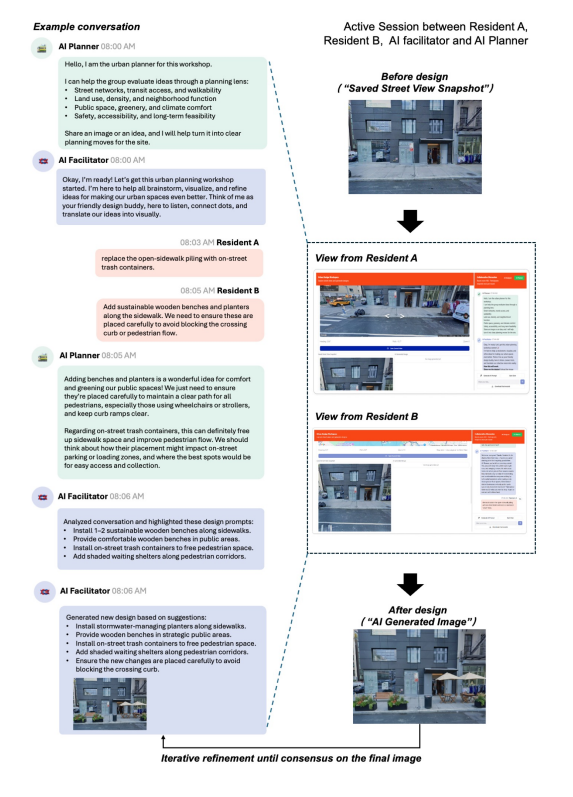

# CoDesign AI Urban Planner — Multi-Agent Urban Design Platform

**Published Research:** [arXiv:2603.16008](https://arxiv.org/abs/2603.16008)

React 18 · TypeScript · Node.js · Gemini API · Google Maps API · Firestore · Google Cloud Storage

---

## What It Does

CoDesign AI is a multi-user, multi-agent platform designed to support participatory urban planning. Community members collaborate in a shared digital workspace alongside specialized AI agents to co-design street-level interventions, resolve spatial conflicts, and synthesize structured design proposals from group dialogue.

## System Architecture

## Stack

| Layer | Technologies |
|---|---|
| Frontend & Maps | React 18, TypeScript, Google Maps API |
| Backend & State | Node.js, Express |
| Multi-Agent Orchestration | Gemini API, Custom Tool Calling |
| Database & Storage | Firestore, Google Cloud Storage |
