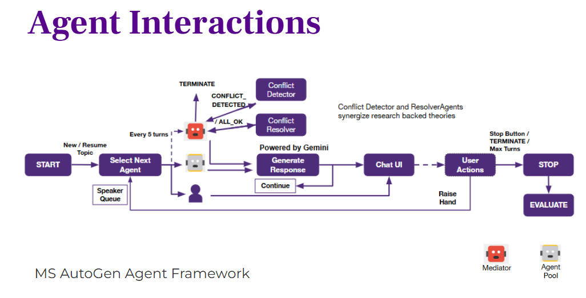

# ConResSim — Multi-Agent Conflict Mediation System

**Presented:** ICUA 2026

Python · Microsoft AutoGen · Gemini 2.5 Flash · Llama 3.3 · LLM-as-Judge

---

## What It Does

ConResSim is a multi-agent simulation system that models real-world group dialogues to detect emerging conflicts and facilitate theory-grounded mediation. Stakeholder agents participate in a shared group chat with distinct roles and goals. A Mediator agent orchestrates the workflow, routing conflict signals to a Detector and Resolver for structured intervention.

## System Architecture

## Stack

| Layer | Technologies |
|---|---|
| Multi-Agent Framework | Microsoft AutoGen |
| LLM (Generation) | Gemini 2.5 Flash |
| LLM (Evaluation) | Llama 3.3 (LLM-as-Judge) |
| Agents | Stakeholder, Mediator, Conflict Detector, Conflict Resolver |
