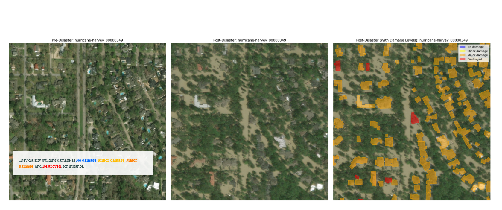

# FEMA Disaster Assistance Predictor

**Interactive Storyboard:** [ArcGIS StoryMap](https://storymaps.arcgis.com/stories/249c7616cc87454f8f9058be3afac771)

Python · XGBoost · Wide and Deep Neural Networks · ArcGIS · National Risk Index

---

## What It Does

Developed at NYU Tandon, this predictive modeling pipeline forecasts federal disaster assistance eligibility and individual claim costs. It combines historical OpenFEMA datasets (100K+ records) with geospatial risk metrics from the FEMA National Risk Index to evaluate model accuracy against compute constraints.

## Geographic Risk Analysis

## Key Technical Decisions

**Tabular Deep Learning Benchmarking.** Evaluated model tradeoffs between traditional gradient-boosted trees and deep architectures. Trained XGBoost models alongside Wide and Deep Neural Networks to analyze execution latency versus prediction error. 

**Feature Engineering.** Integrated historical claim variables with local geospatial indicators. Constructed custom training subsets to represent demographic vulnerabilities, historical flooding patterns, and regional economic capacity indicators.

**Performance Optimization.** Achieved a 6.23% Mean Absolute Percentage Error (MAPE) on test data. Deployed models on local GPU instances to benchmark inference times under high-concurrency request simulations.

## Stack

| Layer | Technologies |
|---|---|
| Modeling & Inference | Python, XGBoost, TensorFlow, scikit-learn |
| Geospatial Processing | ArcGIS, Spatial Indexing |
| Datasets | OpenFEMA Historical Claims, National Risk Index (NRI) |

## Metrics

- 6.23% MAPE score achieved
- Evaluated against 100,000+ historical disaster assistance records
- 1st Place Winner at the NYU ML Data Drive Competition
