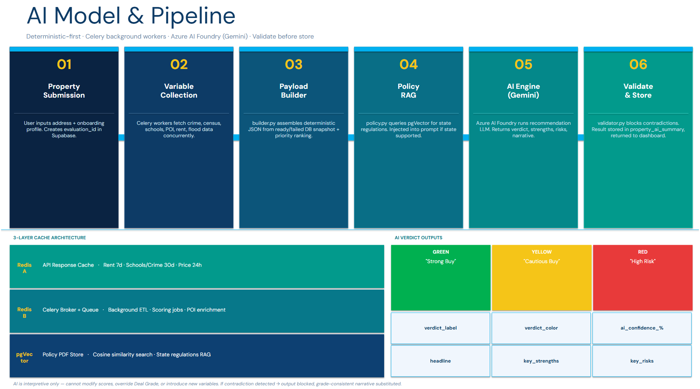
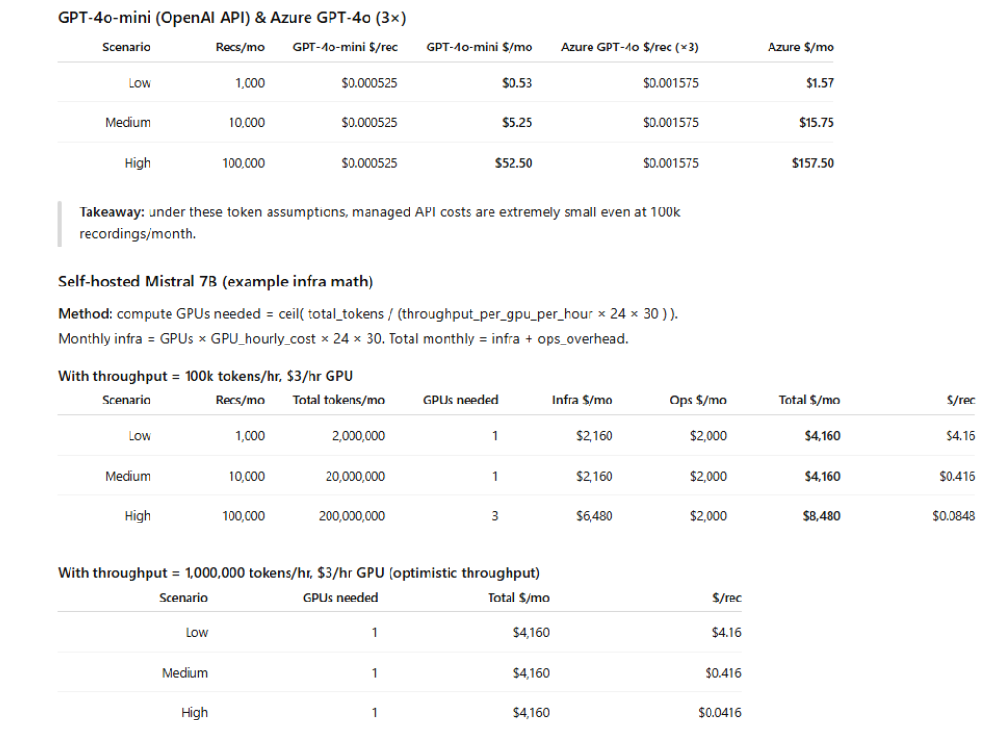

# HouSmart — Property Investment Intelligence Platform

**Live:** [housmart.ai](https://www.housmart.ai) | **Demo:** [YouTube](https://www.youtube.com/@HouSmart-v7c)

FastAPI · Python · PostgreSQL/PostGIS · Asyncio · LangGraph · Gemini · Redis · Next.js · Vercel

---

## What It Does

HouSmart autonomously evaluates any US property by orchestrating 10+ external data APIs (RentCast, FEMA, Census, and others) in parallel. The system synthesizes raw API outputs into a structured property intelligence report with weighted sub-scores, geospatial risk indicators, and plain-text investment verdicts.

## System Architecture

## Key Technical Decisions

**Parallel data extraction.** Sequential API calls were the original bottleneck. Replaced with asyncio-based parallel execution across all 10+ sources simultaneously, reducing pipeline runtime by 90%.

**Human-in-the-loop validation.** Gemini extraction outputs are routed through a HITL review layer with custom validation filters before being written to the database. Schema mismatches are caught and corrected before they propagate downstream.

**Cost control via Redis TTL caching.** Redundant API calls for the same property are eliminated through Redis-backed TTL caches, cutting per-property processing cost to $0.024.

**Geospatial scoring.** PostGIS indexes translate raw latitude/longitude data from Census and FEMA sources into neighborhood-level risk scores, embedded directly into the final property verdict.

## Cost Analysis

## Stack

| Layer | Technologies |
|---|---|
| API & Backend | FastAPI, Python, Asyncio |
| AI & Orchestration | LangGraph, Gemini |
| Database | PostgreSQL, PostGIS, Supabase |
| Caching | Redis (TTL-based) |
| Frontend | Next.js, TypeScript, Vercel |

## Metrics

- 90% reduction in pipeline runtime
- $0.024 per property evaluation
- 10+ APIs orchestrated in parallel
