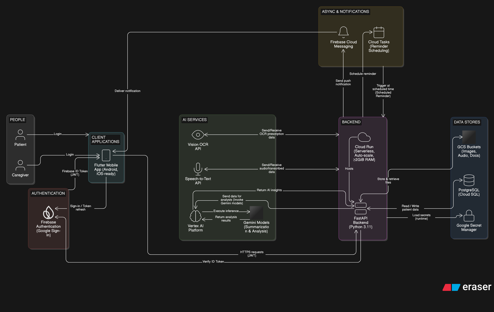
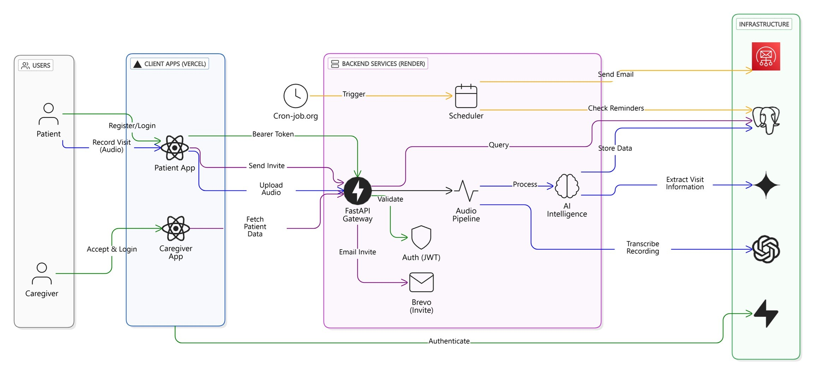
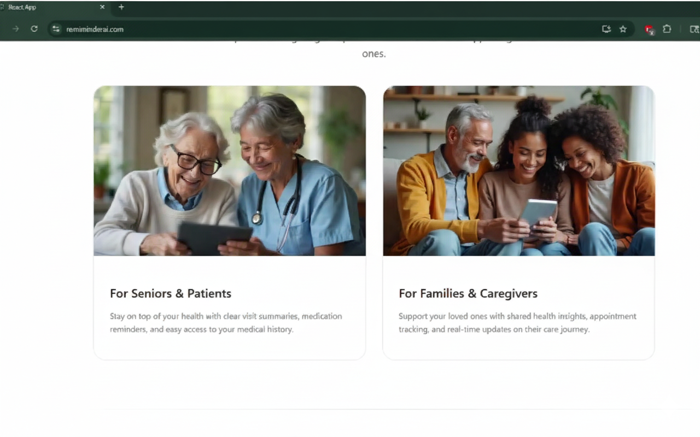

# RemiMinder AI — HIPAA-Compliant Patient Care Platform

**Live:** [remiminderai.com](https://remiminderai.com)

Flutter · FastAPI · GCP Cloud Run · Cloud Tasks · Docker · Whisper · Gemini OCR · Supabase RLS · Firebase JWT · AWS SES

---

## What It Does

RemiMinder AI is a multimodal caregiver reminder platform built under strict HIPAA compliance. It handles clinical transcription (speech-to-text, OCR, and LLM summarization), asynchronous background task management, and multi-tenant data isolation, all running on GCP under a Business Associate Agreement.

## Mobile App

## System Architecture

## Demo

## Key Technical Decisions

**Model benchmarking for cost reduction.** Whisper variants, GPT-4o, and Gemini were benchmarked empirically across latency and cost parameters. The benchmarking results drove a 60% reduction in monthly inference spend without degrading output quality.

**HIPAA-compliant infrastructure.** Firebase JWT/JWKS handles authentication. Supabase Row-Level Security enforces per-tenant data isolation at the database layer. Cloud SQL instances are managed under formal BAA constraints.

**Async background processing.** GCP Cloud Tasks handles background exception queues for scheduled reminders and follow-up actions, ensuring the application stays responsive under concurrent user sessions.

**Multimodal pipeline.** STT (Whisper), OCR (Gemini), and LLM summarization are chained into a single transcription workflow deployed on Cloud Run, containerized with Docker.

## Stack

| Layer | Technologies |
|---|---|
| Mobile | Flutter (Android + iOS), Riverpod |
| Backend | FastAPI, Python |
| AI Pipeline | Whisper STT, Gemini OCR, LLM Summarization |
| Infrastructure | GCP Cloud Run, Cloud Tasks, Cloud SQL, Docker |
| Auth & Security | Firebase JWT/JWKS, Supabase RLS |
| Notifications | AWS SES, FCM |

## Metrics

- 1,000+ monthly user sessions handled
- 60% reduction in inference costs via empirical benchmarking
- Full HIPAA compliance under BAA
