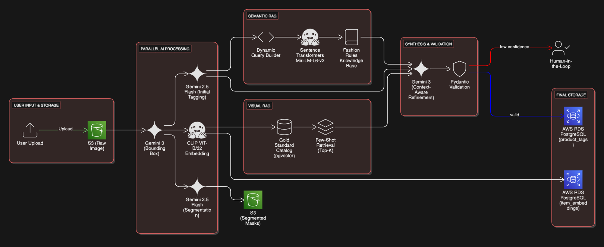
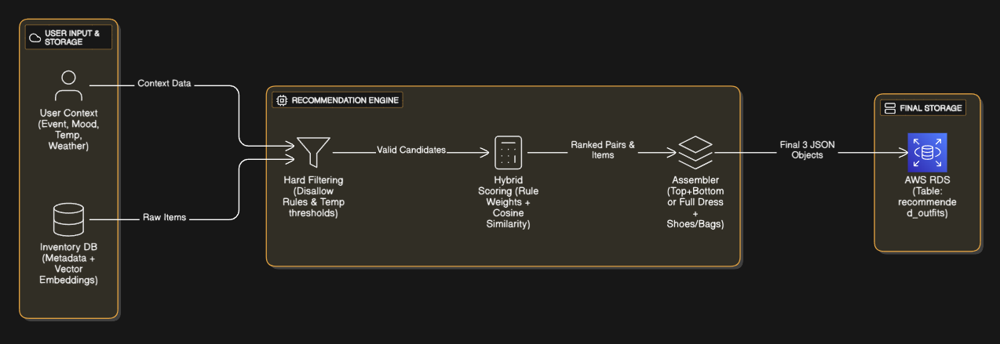
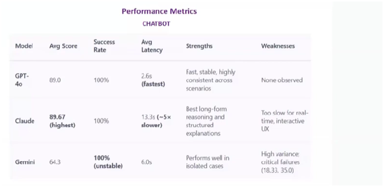
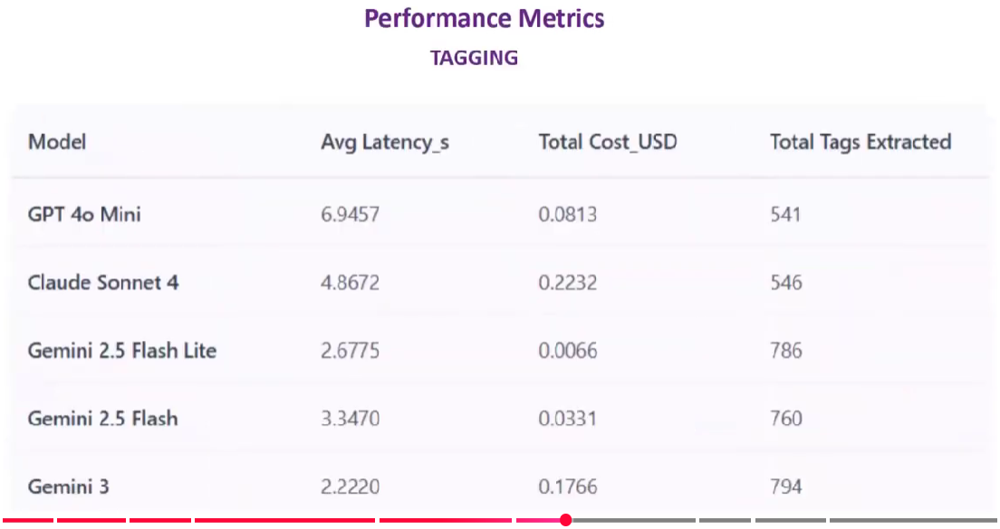

# StylePilot — Computer Vision Styling Platform

**Live:** [stylepilot.ai](https://stylepilot.ai)

CLIP ViT-B/32 · GPT-4o · pgvector · HNSW · FastAPI · AWS (EC2, S3, SQS, RDS) · React Native · JavaScript · Docker · GitHub Actions

---

## What It Does

StylePilot is an AI-powered wardrobe and styling engine. It processes raw visual inputs to tag clothing items, index visual profiles using high-dimensional vector representations, and run similarity searches to serve personal recommendation requests.

## Recommendations and Visual Grounding

## Demo

## Key Technical Decisions

**Retrieval cost optimization.** Querying visual similarities directly through complex downstream LLMs for every search was too expensive. Designed a hybrid vector search strategy matching pgvector HNSW indexing with candidate model pruning rules, which bypassed expensive LLM synthesis calls for 90% of requests while keeping query retrieval latency under 10ms.

**Multi-model deployment.** Deployed 5 distinct vision and recommendation models across 4 containerized microservices. SQS queues act as buffers between these services to keep processing asynchronous and robust under load spikes.

**Mobile to cloud integration.** Delivered a React Native application to 50+ iOS beta users using TestFlight, backed by a production AWS stack optimized to a strict $42/month baseline.

## Performance Metrics

## Stack

| Layer | Technologies |
|---|---|
| Frontend | React Native, JavaScript, TestFlight |
| Backend | FastAPI, Python |
| Vector DB & Search | PostgreSQL, pgvector, HNSW |
| Inference & ML Models | CLIP ViT-B/32, GPT-4o, Nano Banana |
| Infrastructure | AWS (EC2, RDS, S3, SQS, Cognito), Docker, GitHub Actions |

## Metrics

- sub-10ms query retrieval latency
- 90% drop in downstream LLM processing calls
- Pinned to a $42/month AWS server baseline
